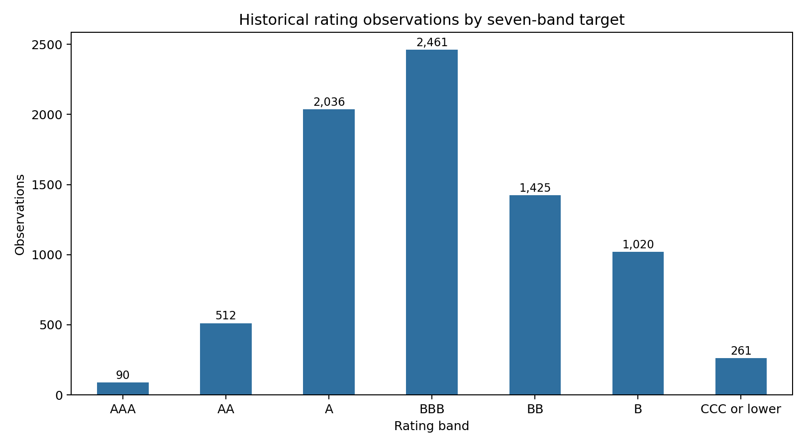
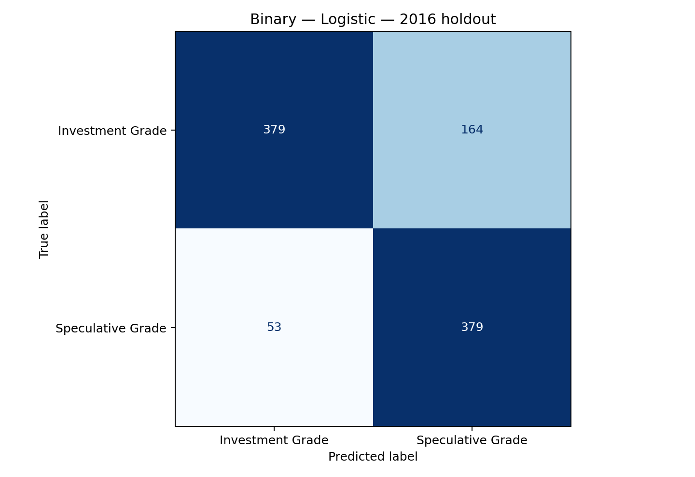
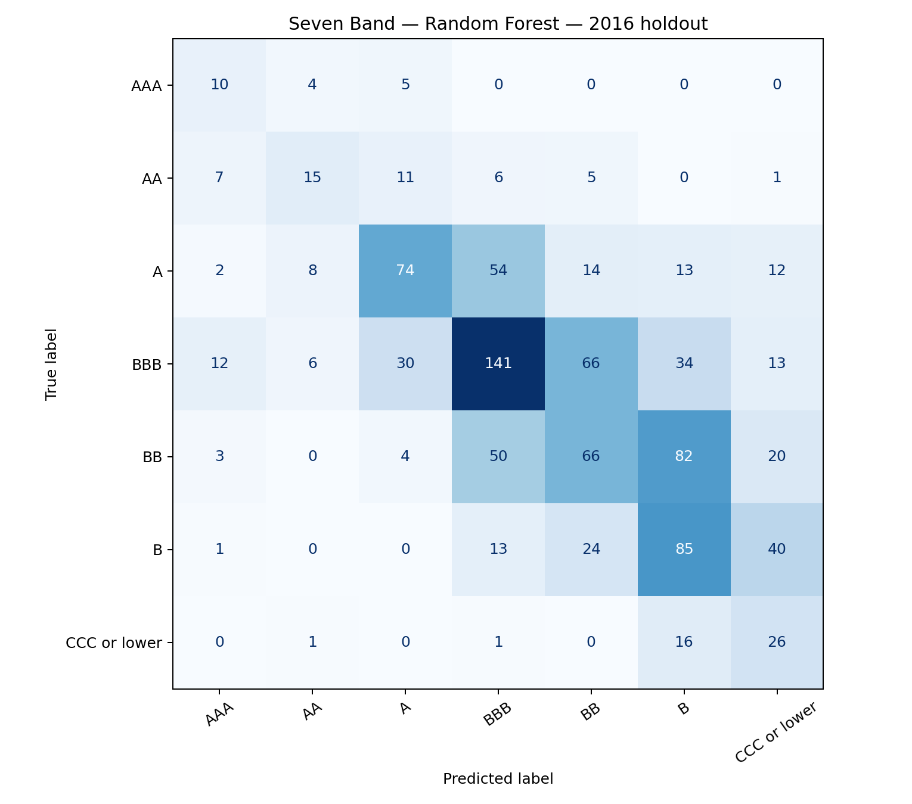

# Corporate Credit Rating Classification


A leakage-aware classification benchmark built from historical public corporate
ratings and financial ratios. The project is being rebuilt from an exploratory
classroom notebook into a reproducible portfolio project with explicit target
definitions, chronological validation, issuer-grouped validation, automated
tests, and honest limitations.

## Project objective

The project answers two related questions:

1. **Primary task:** classify an issuer rating as investment grade or
   speculative grade.
2. **Extension task:** classify the rating into seven ordered bands: AAA, AA,
   A, BBB, BB, B, and CCC-or-lower.

The original 23-grade target is not used as the headline benchmark because
several notches have too few observations for credible out-of-sample
evaluation.

## Why this rebuild matters

The earlier notebook randomly split repeated issuer observations and included
`Binary Rating` as a predictor of `Rating`. Because `Binary Rating` is derived
from the target, that design leaked the answer into the model. This version:

- constructs targets from `Rating` but never exposes either target to the model;
- excludes issuer identifiers, ticker symbols, corporation names, and dates
  from the feature matrix;
- evaluates a future 2016 holdout after training on 2010–2015 observations;
- separately reports issuer-grouped cross-validation to test performance on
  unseen companies;
- fits imputation, encoding, and scaling only inside each training pipeline;
- emphasizes balanced accuracy, macro-F1, speculative-grade recall, and
  ordinal error rather than accuracy alone.

## Data

Source: [Corporate Credit Rating With Financial Ratios](https://www.kaggle.com/datasets/kirtandelwadia/corporate-credit-rating-with-financial-ratios)
by Kirtan Delwadia, licensed under CC BY 4.0.

The dataset contains 7,805 historical rating observations from 2010–2016,
multiple rating agencies, sector and SIC metadata, and 16 financial ratios.
The raw CSV is not committed to this repository.

```bash
python scripts/download_data.py
```

See [`data/README.md`](data/README.md) for details.

## Target definitions

### Binary task

- **Investment grade:** AAA through BBB-
- **Speculative grade:** BB+ through D

The source `Binary Rating` column is retained only for audit comparison and is
never used as a model input.

### Seven-band task

| Target band | Source ratings |
|---|---|
| AAA | AAA |
| AA | AA+, AA, AA- |
| A | A+, A, A- |
| BBB | BBB+, BBB, BBB- |
| BB | BB+, BB, BB- |
| B | B+, B, B- |
| CCC-or-lower | CCC+, CCC, CCC-, CC+, CC, C, D |

## Validation design

Two complementary protocols are reported:

1. **Chronological holdout:** development data from 2010–2015 and untouched
   test data from 2016.
2. **Unseen-issuer validation:** five-fold `StratifiedGroupKFold`, grouped by
   CIK, on the development period.

The chronological test estimates forward performance. The grouped protocol
tests whether the model generalizes beyond issuers represented in training.

## Repository structure

```text
.
├── data/
│   ├── README.md
│   ├── raw/
│   └── processed/
├── outputs/
│   ├── charts/
│   └── metrics/
├── docs/
│   ├── data_dictionary.md
│   └── model_card.md
├── notebooks/
│   └── 01_credit_rating_benchmark.ipynb
├── scripts/
│   ├── audit_data.py
│   ├── download_data.py
│   └── train.py
├── src/credit_rating/
│   ├── audit.py
│   ├── data.py
│   ├── evaluation.py
│   └── modeling.py
├── tests/
├── pyproject.toml
└── requirements.txt
```

## Run locally

```bash
python3 -m venv .venv
source .venv/bin/activate
python -m pip install --upgrade pip
python -m pip install -e ".[dev]"

python scripts/download_data.py
python -m pytest -q

python scripts/audit_data.py
python scripts/train.py --task all --model auto
```

Metrics are written to `outputs/metrics/`; confusion matrices are written to
`outputs/charts/`. Automatic model selection uses only the 2015 validation
partition; the 2016 holdout is evaluated after selection.

## Current models

- Class-weighted multinomial/binary logistic regression as a transparent
  baseline
- Class-weighted random forest as a nonlinear comparison

Model selection is based on validation evidence, not model complexity.

Detailed governance and use constraints are documented in the
[`model card`](docs/model_card.md). Field definitions and exclusions are
documented in the [`data dictionary`](docs/data_dictionary.md).
The concise [`analysis notebook`](notebooks/01_credit_rating_benchmark.ipynb)
provides a recruiter-friendly walkthrough without duplicating production logic.

## Verified benchmark results

The following results were generated from the documented public dataset. Model
selection used 2015 only; the listed holdout metrics are from 2016.

| Task | Selected model | 2016 balanced accuracy | 2016 macro-F1 |
|---|---:|---:|---:|
| Investment grade vs. speculative grade | Logistic regression | 0.788 | 0.777 |
| Seven ordered rating bands | Random forest | 0.451 | 0.405 |

For the binary task, speculative-grade recall is **0.877**, ROC-AUC is
**0.881**, and average precision is **0.836**. On issuer-grouped
cross-validation, balanced accuracy is **0.704 ± 0.040**, which is lower than
the chronological result and provides a more cautious estimate for unseen
companies.

For the seven-band extension, the 2016 ordinal mean absolute error is
**0.830 bands**, and **82.8%** of predictions fall within one broad rating band
of the observed label. Issuer-grouped macro-F1 is **0.353 ± 0.047**, confirming
that fine-grained rating prediction remains the more difficult and less stable
task.

### Rating distribution



### Primary-task holdout matrix



### Seven-band holdout matrix



## Limitations

- The observations are historical (2010–2016) and should not be presented as
  current market evidence.
- Public financial ratios omit qualitative, structural, macroeconomic, and
  forward-looking information used in professional credit analysis.
- Rating agencies may apply different scales and methodologies; the source
  data does not fully document harmonization.
- Multiple ratings can share the same financial vector, so the target contains
  irreducible disagreement not explained by available predictors.
- The work is an educational public-data benchmark, not a production rating
  system and not investment advice.

## Next steps

- Add probability calibration and threshold analysis for the binary model.
- Investigate agency-aware and sector-aware error patterns.
- Add time-aware feature engineering without exposing rating dates to the
  estimator.
- Automate data retrieval, testing, and benchmark regeneration in CI while
  keeping the raw licensed dataset out of version control.
